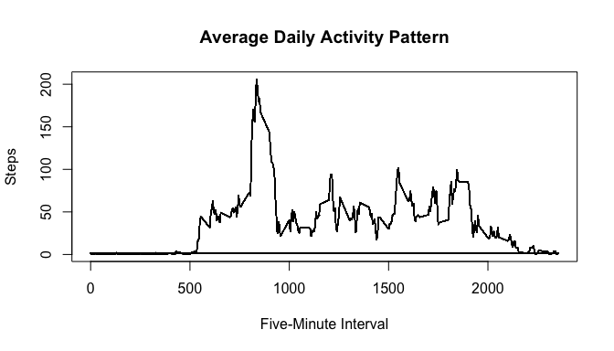
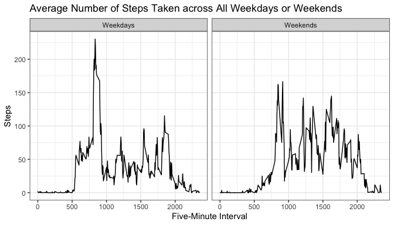

## Download, Unzip and Read the Data
I first download and unzip the data into the working directory, RRProj1.

```r
setwd("~/RRProj1")
fileUrl <- ("https://d396qusza40orc.cloudfront.net/repdata%2Fdata%2Factivity.zip")
download.file(fileUrl, "Factivity.zip")
unzip("Factivity.zip")
```
Then, read the csv data into `tempDT`.

```r
library(data.table)
tempDT <- read.table("activity.csv", sep=",", header=TRUE)
```

## Observe the data
Let's take a look at the data table.

```r
str(tempDT)
```

```
## 'data.frame':	17568 obs. of  3 variables:
##  $ steps   : int  NA NA NA NA NA NA NA NA NA NA ...
##  $ date    : chr  "2012-10-01" "2012-10-01" "2012-10-01" "2012-10-01" ...
##  $ interval: int  0 5 10 15 20 25 30 35 40 45 ...
```

```r
summary(tempDT)
```

```
##      steps            date              interval     
##  Min.   :  0.00   Length:17568       Min.   :   0.0  
##  1st Qu.:  0.00   Class :character   1st Qu.: 588.8  
##  Median :  0.00   Mode  :character   Median :1177.5  
##  Mean   : 37.38                      Mean   :1177.5  
##  3rd Qu.: 12.00                      3rd Qu.:1766.2  
##  Max.   :806.00                      Max.   :2355.0  
##  NA's   :2304
```

```r
head(tempDT, n=10)
```

```
##    steps       date interval
## 1     NA 2012-10-01        0
## 2     NA 2012-10-01        5
## 3     NA 2012-10-01       10
## 4     NA 2012-10-01       15
## 5     NA 2012-10-01       20
## 6     NA 2012-10-01       25
## 7     NA 2012-10-01       30
## 8     NA 2012-10-01       35
## 9     NA 2012-10-01       40
## 10    NA 2012-10-01       45
```

## Answer the Questions
### A. What is mean total number of steps taken per day? 
In this section, I create a new data frame `dataDT` from `tempDT`. Then, compute the total number of steps taken per day using the `tapply` argument. The values are stored in a new variable `totsteps`.

```r
dataDT <- tempDT
dataDT$totsteps <- tapply(dataDT$steps, dataDT$date, sum)
```
I then visualize `totsteps` values using a histogram with the base system.

```r
hist(dataDT$totsteps, 
     breaks=15,
     main="Total Number of Steps Taken per Day",
     xlab="Steps",
     ylab="Frequency")
```

<!-- -->
  
Finally, I compute the mean and median of the total number of steps taken per day. The mean is:

```r
print(old_mean <- mean(dataDT$totsteps, na.rm=TRUE))
```

```
## [1] 10766.19
```
And, the median is:

```r
print(old_median <- median(dataDT$totsteps, na.rm=TRUE))
```

```
## [1] 10765
```


### B. What is the average daily activity pattern?
First, I visualize the average daily activity pattern. I create a time series plot of the average number of steps taken, across all days by five minute intervals. To do so, I average `steps` by `interval`, using `tapply`. I store the computed values in a variable `avgsteps` in the `dataDT`.

```r
dataDT$avgsteps <- tapply(dataDT$steps, dataDT$interval, mean, na.rm=TRUE)
```
Here is the plot.

```r
plot(dataDT$interval, dataDT$avgsteps,
     type="l",
     main="Average Daily Activity Pattern",
     xlab="Five-Minute Interval",
     ylab="Steps")
```

<!-- -->

Finally, I identify the five-minute interval that contains the maximum number of steps on averag across all days in the dataset. I first identify the row at which the maximum number is located, and then print the corresponding five-minute interval value.

```r
print(dataDT[which.max(dataDT$avgsteps),3])
```

```
## [1] 835
```


### C. Imputing missing values
In the first part of this section, I work with the original data frame `tempDT`. Let's first count the number of rows with missing values to get a better sense of where thee missing values come from. I first change the class of `date` variable from character to date class. Then, use `complete.cases` and `sum` to count the number of rows with missing values.

```r
tempDT$date <- as.Date(tempDT$date, format="%Y-%m-%d")
sum(!complete.cases(tempDT))
```

```
## [1] 2304
```
The number of incomplete cases equal to the number of NAs from `steps` variable, and the missing values are only in `steps` variable. 

```r
summary(tempDT)
```

```
##      steps             date               interval     
##  Min.   :  0.00   Min.   :2012-10-01   Min.   :   0.0  
##  1st Qu.:  0.00   1st Qu.:2012-10-16   1st Qu.: 588.8  
##  Median :  0.00   Median :2012-10-31   Median :1177.5  
##  Mean   : 37.38   Mean   :2012-10-31   Mean   :1177.5  
##  3rd Qu.: 12.00   3rd Qu.:2012-11-15   3rd Qu.:1766.2  
##  Max.   :806.00   Max.   :2012-11-30   Max.   :2355.0  
##  NA's   :2304
```
Now, I duplicate the original data table `tempDT` into a new data table `filledDT` and replace the missing values with the mean for that five-minute interval. I also create `totsteps` in this data frame from computing the total number of steps taken per day.

```r
filledDT <- tempDT
filledDT$steps[which(is.na(filledDT$steps))]=tapply(filledDT$steps, filledDT$interval, mean, na.rm=TRUE)
filledDT$totsteps <- tapply(filledDT$steps, filledDT$date, sum)
```
The histogram now becomes

```r
hist(filledDT$totsteps, 
     breaks=15,
     main="Total Number of Steps Taken per Day",
     xlab="Steps",
     ylab="Frequency")
```

<!-- -->

Finally, I compute the mean and median of the total number of steps taken per day using the `filledDT` data table. 

```r
new_mean <- mean(filledDT$totsteps)
new_median <- median(filledDT$totsteps)
```

Now let's compare the above results with those from dataset with missing values. While the mean remains the same at 1.0766189\times 10^{4}, the median slightly increases from 1.0765\times 10^{4} to 1.0766189\times 10^{4} once missing values are replaced. This is because the mean values are reinforced after we replace the missing values with average values. Also, the number of frequencies for each bar in histogram doubles.

### D. Are there differences in activity patterns between weekdays and weekends?
In this section, I use `filledDT` to create a factor variable `wday` indicating whether a given date is a weekday or weekend day. 

```r
filledDT$wday <- ifelse(weekdays(filledDT$date) %in% c("Saturday", "Sunday"), "weekend", "weekday")
```
To visualize the difference, I make a panel plot containing time-series plot of the five minute interval and the average number of steps taken across all weekday days or weekend days. To do so, I compute the average of steps taken for each interval and by `wday` factor variable inputs, and create a new data table `plotDT`.

```r
plotDT <- aggregate(steps ~ interval + wday, FUN=mean, data=filledDT)
```
And, here is the panel plot, created from the ggplot2 system. 

```r
varNames <- list("weekday"="Weekdays", "weekend"="Weekends")
varLab <- function(variable, value)(return(varNames[value]))

library(ggplot2)
plot <- ggplot(plotDT, mapping=aes(x=interval, y=steps))
plot + geom_line() +
    facet_wrap(~wday, nrow=1, labeller=varLab) +
    labs(title="Average Number of Steps Taken across All Weekdays or Weekends",
         x="Five-Minute Interval",
         y="Steps") +
    theme_bw()
```

```
## Warning: The `labeller` API has been updated. Labellers taking `variable` and `value`
## arguments are now deprecated.
## ℹ See labellers documentation.
```

<!-- -->
